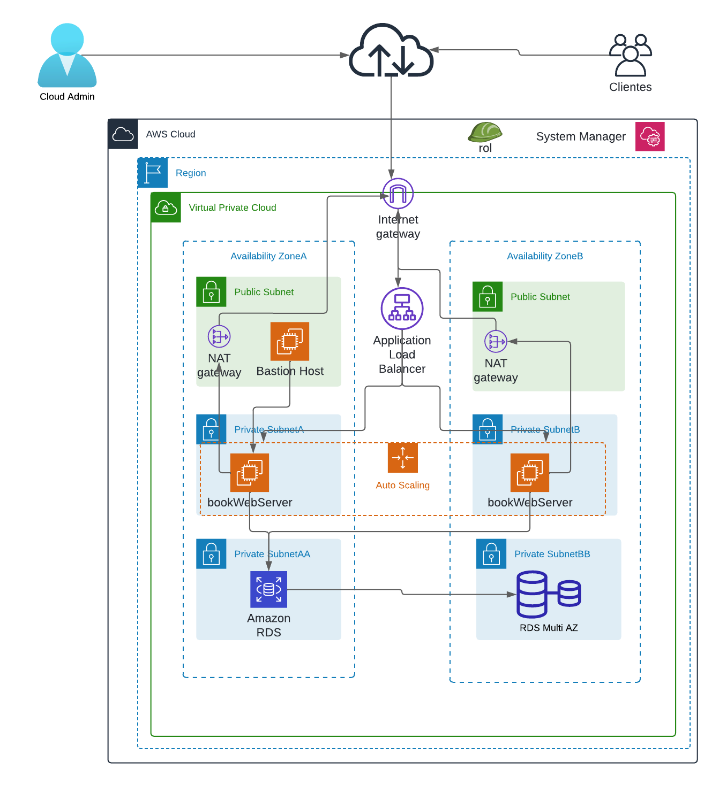

# Implementar una arquitectura segura, de alta disponibilidad y escalable en AWS.

En esta guía, configuraré una Virtual Private Cloud (VPC) para implementar un servidor web basado en Python y una base de datos MySQL en una arquitectura segura, de alta disponibilidad y escalable.

  

## Se va a implementar la arquitectura que se observa en la siguiente imágen en AWS. 


<hr>
1. Se configura la infraestructura de red utilizando el servicio AWS VPC.

- Voy a crear una VPC con el siguiente bloque CIDR IPv4
    - 192.168.0.0/16

- Voy a crear las seis subredes con los siguientes nombres:
    - **PublicSubnetA**:
        - Zona de disponibilidad: a
        - CIDR: 192.168.1.0/24

    - **PublicSubnetB**:
        - Zona de disponibilidad: b
        - CIDR: 192.168.2.0/24

    - **PrivateSubnetA**:
        - Zona de disponibilidad: a
        - CIDR: 192.168.3.0/24
    
    - **PrivateSubnetB**:
        - Zona de disponibilidad: b
        - CIDR: 192.168.4.0/24
    
    - **PrivateSubnetAA**:
        - Zona de disponibilidad: a
        - CIDR: 192.168.5.0/24
    
    - **PrivateSubnetBB**:
        - Zona de disponibilidad: b
        - CIDR: 192.168.6.0/24

Como se necesita que la VPC tenga una conexión a Internet, se debe configurar un **Internet Gateway**.

   - Cuando se crea el Internet Gateway, se conecta a la VPC
   - Creo una tabla de enrutamiento (Route Table)
   - En la Route Table asocio las dos **subredes públicas** y creo una ruta para permitir la conexión a Internet a través del **Internet Gateway**

<hr>

2. Usaré el servicio AWS System Manager para almacenar los parámetros de conexión que usarán las instancias EC2 donde se ejecutará el servidor web para conectarse a la base de datos configurada en AWS RDS.

- Utilizando AWS System Manager con Parameter Store creo los siguientes parámetros:
    - /book/user: root
    - /book/password: *Test!2024* (se utiliza el tipo *SecureString*)
    - /book/database: books_db
    - /book/host: 192.168.1.23 (Se debe modificar por el EndPoint de la base de datos en AWS RDS)

- El servidor web se ejecutará en la instancia EC2 y necesita leer los parámetros de conexión a la base de datos implementada en RDS, por lo tanto necesito crear un rol de IAM que tenga permiso para que EC2 lea los parámetros de conexión desde el servicio System Manager.
    - En el servicio IAM creo un rol llamado *ec2RoleSSM*.
    - El rol tiene el siguiente permiso:
        - SSMFullAccess

<hr>

3. Voy al servicio AWS EC2 y creo cuatro grupos de seguridad.

- El primer grupo de seguridad tiene los siguientes parámetros:

    - Nombre: alb-SG
    - Reglas de entrada:
    - Tipo: TCP personalizado
    - Rango de puertos: 80
    - Origen: Cualquier lugar

- El segundo grupo de seguridad tiene los siguientes parámetros:

    - Nombre: web-server-SG
    - Reglas de entrada:
    - Tipo: TCP personalizado
    - Rango de puertos: 5000
    - Origen: alb-SG *(El SG del Application Load Balancer)*

- El tercer grupo de seguridad tiene los siguientes parámetros:

    - Nombre: database-SG
    - Reglas de entrada:
    - Tipo: MYSQL/Aurora
    - Rango de puertos: 3306
    - Origen: web-server-SG *(El SG del servidor web)*

- El cuarto grupo de seguridad tiene los siguientes parámetros:

    - Nombre: bastionHost-SG
    - Reglas de entrada:
    - Tipo: ssh
    - Rango de puertos: 22
    - Origen: MyIP (te debes conectar a la terminal de la instancia desde Putty)
<hr>

4. Voy al servicio AWS EC2 y lanzo una instancia EC2 en la **PublicSubnet** con las siguientes configuraciones
    - AMI: *Amazon Linux 2023*
    - Instance Type: *t2.micro*
    - Key Pair: asociar un par de claves
    - Network settings:
        - VPC
        - Public Subnet: habilitar *Public IP*
        - Asociar el grupo de seguridad del host bastión
    - Detalles avanzados:
        - IAM instance profile: asociar el rol creado anteriormente
        - User data: *copiar las siguientes líneas a los datos del usuario*
        ```
        #!/bin/bash
        sudo dnf install -y python3.9-pip
        pip install virtualenv
        sudo dnf install -y mariadb105-server
        sudo dnf install -y git
        sudo service mariadb start
        sudo chkconfig mariadb on
        pip install flask
        pip install mysql-connector-python
        pip install boto3
        git clone https://github.com/jhormanvillanueva/architecture-ha-ha.git
        sudo mv architecture-ha-ha /home/ec2-user
        ```
    - Una vez que se completa el lanzamiento de la instancia, me conecto a la terminal, pruebo que las librerías estén instaladas y que el repositorio se haya clonado en EC2.

    - Para ejecutar el servidor web, ejecuto el siguiente comando en el directorio donde se encuentra app.py. Debe asegurarse de que el grupo de seguridad tenga habilitado el puerto apropiado.

                python3 -m virtualenv venv
                source venv/bin/activate
                python app.py

    - Hasta el momento no se ha configurado la base de datos. Voy al directorio llamado databases y ejecuto los siguientes comandos

                sudo chmod +x set-root-user.sh createdb.sh
                sudo ./set-root-user.sh
                sudo ./createdb.sh

    - Puede verificar si la base de datos fue creada ejecutando el siguiente comando:

                sudo mysql
                show databases;
                use books_db;
                show tables;
                SELECT * FROM Books;

    - La base de datos no está configurada en AWS RDS sino en AWS EC2. Por lo tanto, más adelante, configuraré AWS RDS.

    - Desde la terminal de la instancia, creo el siguiente archivo para que el servidor web se ejecute en segundo plano. 

                sudo nano /etc/systemd/system/bookapp.service

    - Este archivo debe tener el siguiente código

            [Unit]
            Description=My Flask Application

            [Service]
            User=ec2-user
            WorkingDirectory=/home/ec2-user/architecture-ha-ha
            ExecStart=/usr/bin/python3 /home/ec2-user/architecture-ha-ha/app.py
            Restart=always

            [Install]
            WantedBy=multi-user.target
                

    - Necesitas recargar el daemon (demonio)

                sudo systemctl daemon-reload

    - Necesita iniciar el servicio

                sudo systemctl start bookapp

    - Debes habilitar el servicio cuando se inicia la instancia.

                sudo systemctl enable bookapp

5. Voy a AWS RDS para configurar el servicio de base de datos relacional.

    - Creo un grupo de subredes para privateSubnetAA y privateSubnetBB.
    - Creo AWS RDS con los siguientes parámetros:

        - Tipo de motor: MariaDB o MySQL
        - Plantillas: Free tier

            - Master Username: el mismo usuario que creó en AWS System Manager
            - Master Password: la misma contraseña que creó en AWS System Manager.
            - Virtual Private Cloud (VPC): la VPC que se creó en el paso uno.
            - Grupo de subredes de base de datos: el grupo de subredes de base de datos creado.
            - Grupos de seguridad de VPC existentes: asocie el grupo de seguridad de base de datos creado en el paso tres.

            - Cuando finalmente se crea AWS RDS, copio el punto de conexión (Endpoint) de RDS. Puede actualizar el parámetro /book/host en AWS System Manager.
<hr>


6. En este paso, migraré la base de datos de AWS EC2 a AWS RDS.

    - Desde la terminal de la instancia de AWS EC2, ejecuto los siguientes comandos:

    - Verifico la conexión a AWS RDS desde AWS EC2 (debe cambiar rdsEndpoint por el endpoint suministrado por el servicio RDS)
                    
                        mysql -u root -p --host rdsEndpoint
                    

    - Si la conexión es exitosa, puede ejecutar el siguiente comando SQL para ver las bases datos en RDS.

                        show databases;

- Comienzo con la migración con los siguientes comandos:

                mysqldump --databases books_db -u root -p > bookDB.sql

- Al generar el archivo bookDB.sql, se migra a RDS con el siguiente comando (debe cambiar rdsEndpoint por el Endpoint generado por RDS):

                mysql -u root -p --host rdsEndpoint < bookDB.sql

- Puedes verificar si la migración fue exitosa

                mysql -u root -p --host rdsEndpoint
                show databases;
                show tables;
                SELECT * FROM Books;

<hr>

7. En este paso se va a configurar el servicio Auto Scaling Group y el Application Load Balancer.

- Ir al servicio EC2 en AWS.
    - Seleccionar la instancia (Bastion Host) lanzada en la Subred pública y crear una AMI.
    - Crear un Launch Template con la AMI creada anteriormente. Para la configuración de Launch Template:
        - No elegir VPC.
        - Asignar Rol IAM.
        - Crear par de claves: PEM
    - Ir a la configuración de Auto Scaling Group.
        - Elegir la Launch Template configurada anteriormente.
        - No elegir Load Balancer.
        - Seleccionar las subredes privadas en las que se lanzarán las instancias administradas por el grupo de Auto Scaling.
        - Configurar la Política de Escalamiento.
    - Ir a Load Balancers
        - Elegir Application Load Balancer
        - Elegir la VPC creada anteriormente y las dos Subredes Públicas.
        - Crear un Target Group.
        - Elegir las instancias como destino.
            - Configurar el puerto en 5000 (servidor web)
        - Definir la ruta de comprobación de estado como: /health
    - En la configuración del Auto Scaling Group, asociar el balanceador de carga.

8. Por último, puede probar si la aplicación responde desde el balanceador de carga de aplicaciones.

    - Si la aplicación no responde desde el balanceador de carga de aplicaciones, verifique lo siguiente:
        - Reinicie el servicio usando el servicio System Manager
        - En System Manager, elija Fleet Manager.
        - Seleccione los ID de las instancias que se ejecutan en la subred privada.
        - Busque AWS-RunShellScript
        - Escriba los siguientes comandos:

                    sudo systemctl restart bookapp.

        - Verifique las reglas de los grupos de seguridad.
